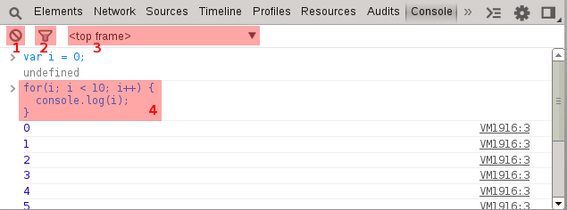

Console
=======

In addition to providing a convenient workspace for testing code, the console also provides a chrome specific API for inspecting and debugging applications. It is important to remember that the console is available from all other tabs by pressing the `Esc` key.

1. Clear the console output
2. Filter the console to display specific output
3. Change the console input to be executed with the context of a specific frame (frame, iframe, or extension).
4. Enter multi-line code with `shift` + `enter`
5. The shortcut `ctrl` + `L` clears the console

####Exercise
Load the console and notice at the top frame the global variable `iFrameApp` is not defined. Switch the frame to iframe.html and it is defined.
<iframe src="../console/iframe.html"></iframe>
