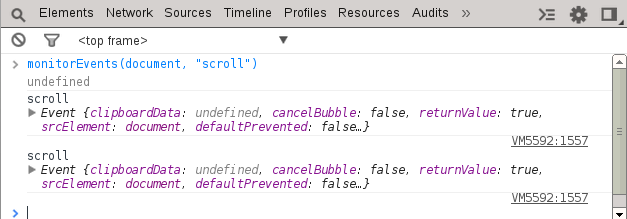

Monitor Events
==============

From the console you can usefully monitor events with the `monitorEvents` API. The API takes an object to be monitored and then an event to listen for. For example:

```javascript
monitorEvents(document, ["scroll"]);
monitorEvents($('#action-button'), ["mousedown", "mouseup"]);
```



To stop monitoring events, simply call `unmonitorEvents()` passing the object to stop monitoring on.

```javascript
unmonitorEvents(document);
```