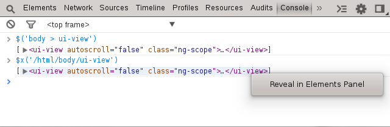

Query DOM
=========

The console provides an API for querying the DOM with CSS selectors or with XPath. Querying with CSS selectors is the same API as jQuery, and will default to jQuery if jQuery is loaded. The XPath API is similar except with `$x('my/xpath')`

When ever a DOM element is output within the console, you can right click the element and select `Reveal in Elements Panel` to reveal its location. Remember, within the elements panel, we can right click any element and copy its XPath or CSS location.

As you select elements within the elements pane, chrome retains a history of objects selected. From the console, you can reference previously selected elements with `$0, $1, $2, $3, $4` with `$0` being the most recent.