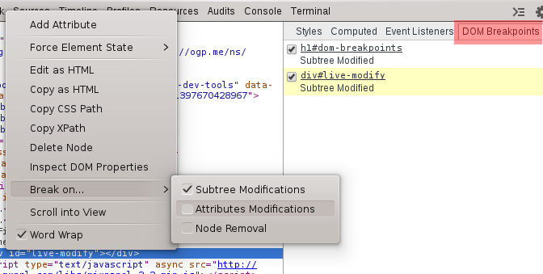

DOM Breakpoints
===============

DOM Breakpoints are useful to break on DOM mutation events, such as when a node is removed, modified, or its attributes are changed.
You can view all current DOM breakpoints on the `DOM Breakpoint` tab.

####Find which script is modifying the following element by using DOM Breakpoints:

	0

