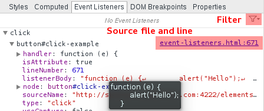

Event Listeners
===============

Inspect event listeners associated with individual DOM nodes. Use the filter icon to restrict the event listeners to only the selected node.

####Exercise‎
Find the onclick handler definition for the button below:

<button id="click-example">Alert Me</button>

