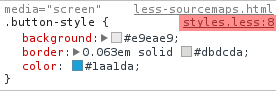
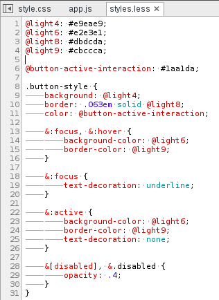

LESS and SASS Source Maps
=========================
Chrome supports mapping the transpiled CSS rules back to the original SASS or LESS source. Make sure CSS source maps are enabled within the settings dialog.

####Exercise‎

<button class="button-style">This Button is Styled With Less</button>

<link rel='stylesheet' href='/elements/less-styles.css' type='text/css' media='screen' />

