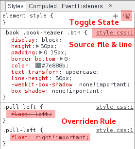

Styles
======

  * The toggle state button allows you to toggle CSS pseudo anchor state.
  * Clicking the source file name or `ctr` + `click` the property will load the associated source file.
  * Properties that are ~~crossed out~~ are either overriden or unknown to Chrome.
  
 
####Inspect the following element and toggle its state.
<textarea class="state-change">State changes</textarea>  
 
 

Increment property values with the following shortcuts:

| Increment Value | key-stroke                             |
|:---------------:|:--------------------------------------:|
| .1              | `alt` + `up` & `alt` + `down`          |
| 1               | `up` & `down`                          |
| 10              | `shift` + `up` & `shift` + `down`      |

<link rel='stylesheet' href='/elements/styles.css' type='text/css' media='screen' />