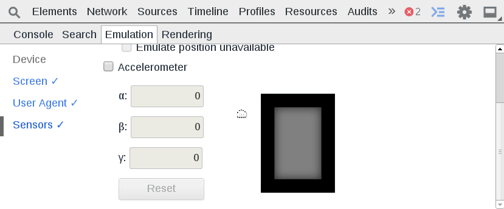

Mobile
======
The primary mobile functionality provided by the developer tools is through device, screen, user-agent, and sensor emulation. The emulation functionality is somewhat hidden within the console slideout available from every pane when you press `Esc`. 

You can either manually modify the screen resolution, pixel ratio, and user agent, or you can pick from pre-existing devices including: Galaxy s4, Nexus 5, iPhone 5, iPad 4, and other devices. 

You can also see how your app behaves based upon the accelerometer and geolocation.

