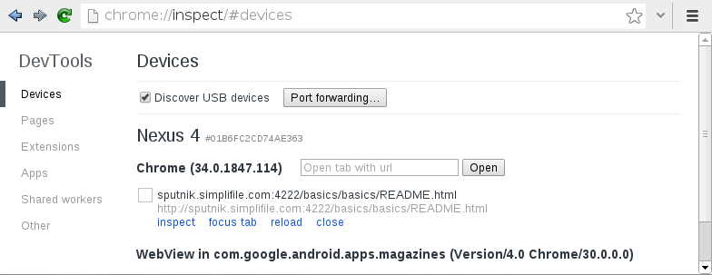
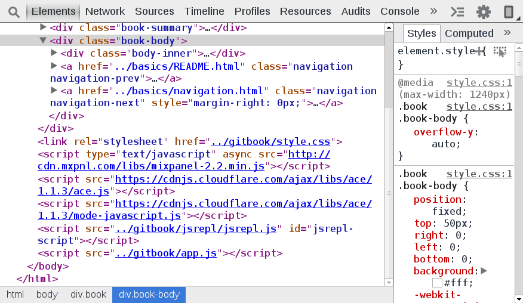

USB Debugging
=============

Remotely debugging allows you the full chrome developer tools enabled within the environment of your remote device. You can remotely debug mobile devices by navigating to [chrome://inspect](chrome://inspect). 

Plug your mobile device into your development machine. Check the checkbox `Discover USB devices`. You may need to authorize the connection on your mobile device. Once authorized, you should see a list of all available inspection targets on your device. Click `inspect` to launch an instance of the developer tools. Within this instance of the dev tools, all functionality should be available.

If your device and version of chrome support it, a new icon  should appear in the very top right of the developer tools. Press this button to enable a screencast from your mobile device to your development machine.
