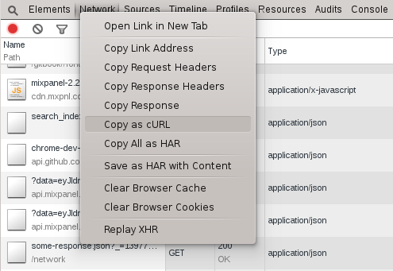

Copy Request Data
=================

Right click individual requests to copy or save XHR data. Particularly useful, the `Copy as cURL` option will generate a `curl` query to reproduce the request. If the request type is `application/json` you can also "replay" the request.

