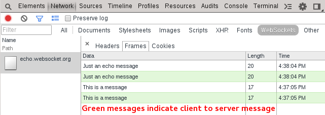

WebSockets
==========

Chrome developer tools contain a websockets view for analyzing websocket message frames.

  * Green messages represent client to server (upload) messages while white represent server to client (download).
  * The frames do not automatically update. Click on the request within the name column to refresh the frames.
  * Right click to copy the data out of the frames.

####Exercise‎
Inspect the frames sent within the following websocket connection:

Message: <input id="socket-message"/><button id="send-socket">Send Message</button>

  