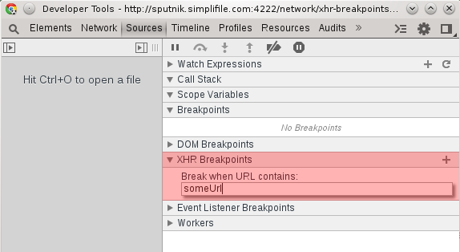

XHR Breakpoints
===============

XHR Breapoints allow you to break whenever a server request URL contains a particular value. Add an XHR breakpoint within the Sources tab. Click the `+` icon and enter a value to break on.

####Exercise‎
Use an XHR breakpoint to determine where in the code the following request orginates from:

<button id='send-request'>Send Request</button>

