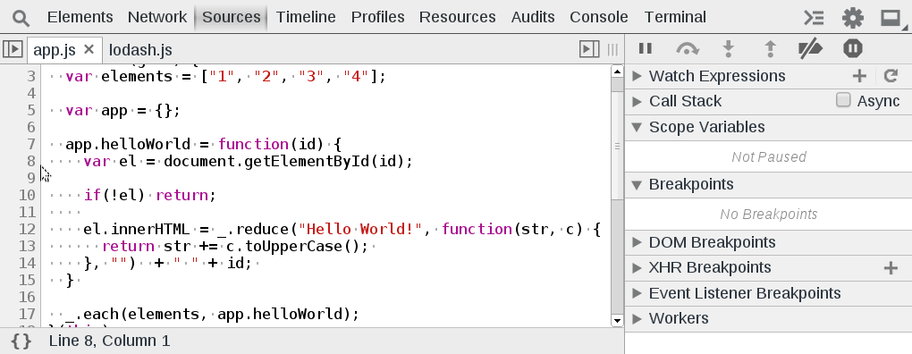

Conditional Breakpoints
=======================

Conditional breakpoints allow you to break inside a code block when a defined expression evaluates to true. Conditional breakpoints highlight as orange instead of blue. Add a conditional breakpoint by right clicking a line number, selecting `Add Conditional Breakpoint`, and entering an expression.

Note: Because the conditional breakpoint simply evaluates an expression, you can add useful logging statements within the expression.