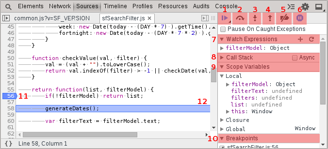

Debugging
=========

1. Resume script execution - `F8`
2. Step over to the nex function call - `F10`
3. Step into the next function call - `F11`
4. Step out of the current function scope - `shift` + `F11`
5. Deactivate all breakpoints. 
6. Pause on exceptions - very useful for inspecting the context of application errors.
7. Watch Expressions - expressions that will be continuously evaluated as you step through the application.
8. Call stack - View and navigate to frames in the call stack. Can evaluate expressions and inspect the context of other frames.
9. Scope Variables - inspect variables within the current context.
10. Breakpoints - a list of all current breakpoints in the application. Enable/disable them through the checkbox.
11. Click a line to add or remove a breakpoint.
12. The currently executing line.