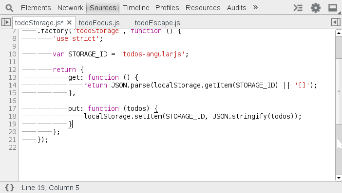

Editing Content
===============

Chrome includes a smart editor live modifying application sources. The editor provides dynamic hints and code auto complete. Changes to CSS files are immediately applied whereas JavaScript modifications are applied with `ctrl` + `S`. If the browser successfully applies your code modifications, `Recompilation and update succeeded.` will be printed to the console.

####Exercise
Open the file, editing-content.js and add complete the method handler for the following button:

<button id="editing-content-button">Click Me</button>

