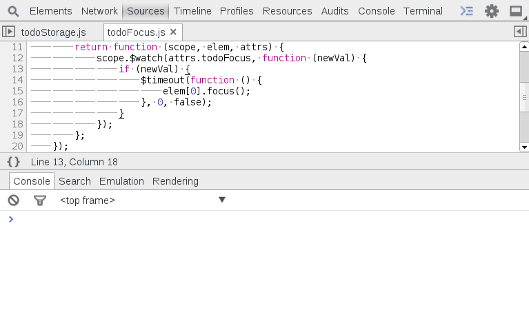

Local Modifications
===================

As you modify source files, an asterisk `*` appended to the filename represents a modified file. After applying the changes, an exclamation icon will in the tab header and the background changes to red to flag that the file has not been saved to disk. Save the file to disk by right clicking the background and selecting `Save As...`.

Chrome tracks the history and modifications to each file. Right click the the file and click `Local Modifications...` to inspect and revert file history events.

