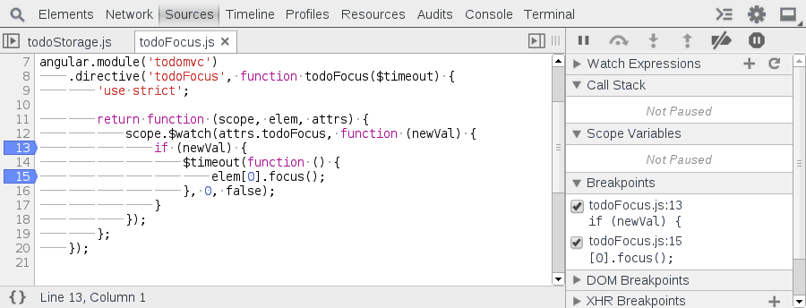

Long Resume
===========

Resume with all pauses blocked for 500ms by long pressing on the resume button and selecting the second resume button in the menu. Useful to skip over many breakpoints.

In this demonstration we hit the first breakpoint twice. When we resume the second time we do not hit the second breakpoint.

####Exercise‎
Open up the developer tools and refresh the page which should automatically break. Examine the difference between resuming and long-resuming the breakpoint.

