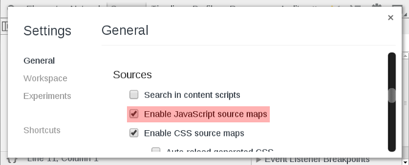
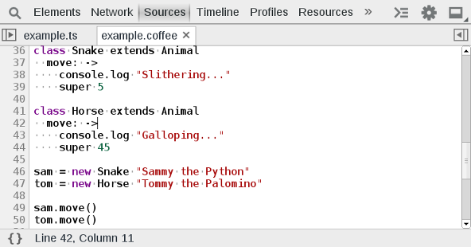

Source Maps
===========

The Chrome dev tools support source maps, which allow you to debug transpiled JavaScript code as their original source language. This may include TypeScript, CoffeeScript, ClojureScript, or ECMAScript 6. Sourcemaps are especially useful because you can place breakpoints, step through, and debug the originally authored source. Make sure that you enable JavaScript source maps by checking the option within the settings:

####Exercise‎
Enable sourcemaps in the developer tool settings. Close and reload the developer tools. Open up `ctrl` + `O` `example.ts` and `example.coffee`. Explore these files by reloading the page with break points placed in the files. 

