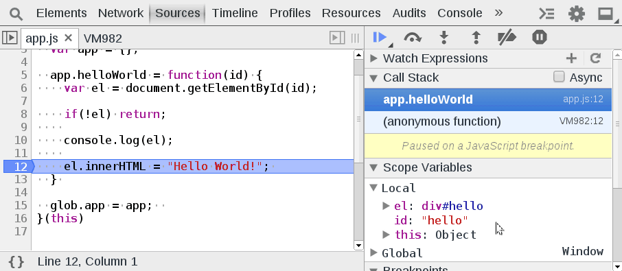

Restart Frame
=============

When at a breakpoint inside debugger mode, you can conveniently restart the current stack frame by right clicking the call stack and selecting `Restart Frame`. This can be useful to inspect the current frame without reloading the page with a new breakpoint.

