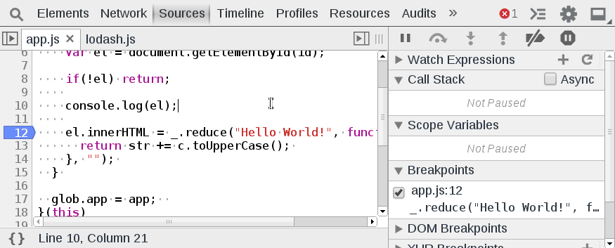

Skipping Frameworks
===================

Often times in debugging a web app, you do not want to step inside framework code, such as jQuery or lodash. Under the `Experiments` section of the settings, enable `Enable frameworks debugging support`. Once enabled, a new option in the settings should appear `Skip stepping through sources with particular names`. The field expects a regular expression file name.

####Exercise‎
Open up the developer tools and refresh the page which should automatically break. Enable skipping frameworks support for `lodash`. In stepping into the lodash.reduce call, examine the difference when it is enabled and disabled.

