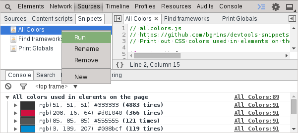

Snippets
========

Chrome provides a "snippets" bucket within the developer tools which allows you to manage small (or large) scripts that can be injected onto a page. Scripts can do things like inject jQuery into a page, log all globally defined variables, or print out all colors from computed styles used in elements on the page.

[Useful JavaScript development snippets](http://bgrins.github.io/devtools-snippets/)