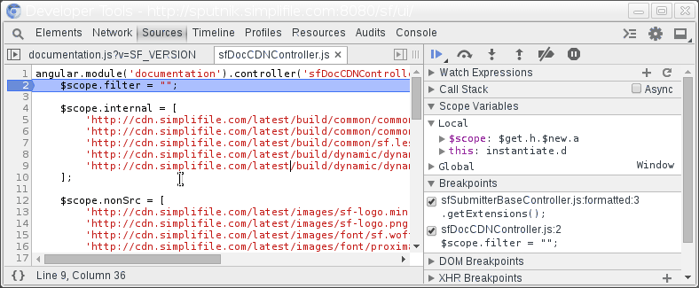

Store as Global
===============

The dev tools allow you to pick a scoped variable and automatically store a reference to it globally. This is convenient in debugging an application where you want to continuously inspect the contents of an object as a global variable. 

Right click a `Scope Variable` and select `Store as Global Variable`. The console will immediately output the temporary name of the now globally available variable.

Note: A beta version of Chrome may be necessary for this feature.