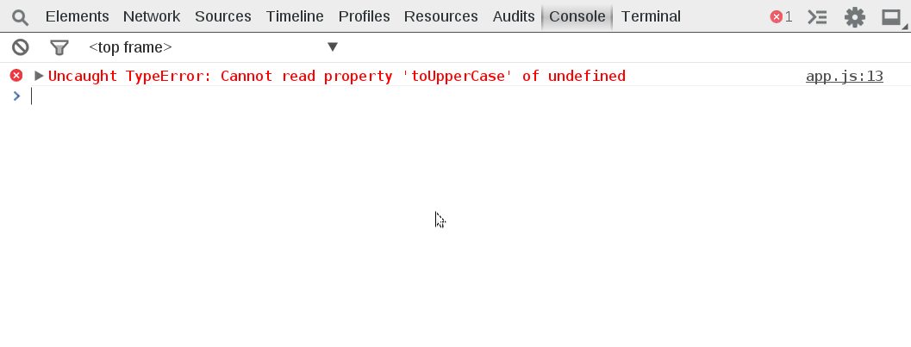

Uncaught Exceptions
===================

Sometimes you may have a console error but have no idea where or how the exception was thrown. You can have the dev tools immediate break at uncaught or caught exceptions by clicking the  icon. Use in conjunction with pretty-print in minfied apps.

####Exercise‎
Reload the page. A error should be in the console. Use the uncaught exceptions to break at the error location and determine how to fix the problem.

