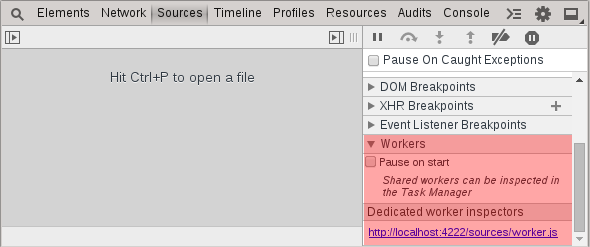

Web Workers
===========
[HTML5 provides an API](http://www.html5rocks.com/en/tutorials/workers/basics/) for spawning background scripts that can run concurrently with the primary JavaScript execution thread. Chrome developer tools provide a convenient way for debugging these background workers (threads). Each separate worker has its own dedicated inspector listed as a link. Clicking on one of the worker inspectors will boot a new instance of the chrome dev tools specific for that background thread. Optionally you can also have workers break automatically when they first boot.

####Exersize
A worker has been started in the background that accepts two numbers, adds them, and returns the result. Pass data to the worker thread and use the chrome developer tools to debug the output.

	<input id="val1"/>+<input id="val2"/>=
	<button id="calculate">Calculate</button>

