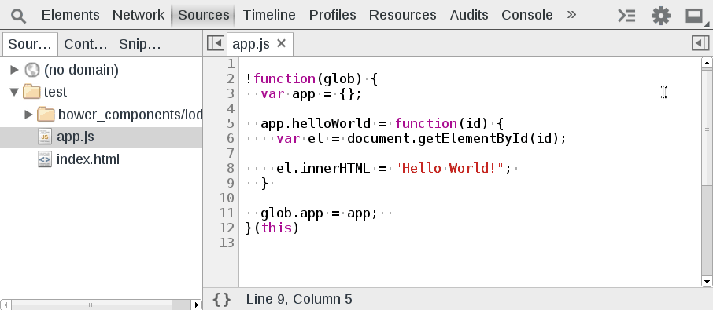

Workspaces
==========

With workspaces you can grant Chrome permission to update your local file system with changes made within the sources editor. Do so by going into the developer tools settings and adding a local directory containing your web app. Confirm Chrome's access to the local file system. Right click a source file and click `Map to File System Resource...` and enter the corresponding local file resource. After restarting the developer tools, all file modifications that are saved (`ctrl` + `S`) will be saved to disk. Chrome will still track a history of revertable modifications.

Notice when the file gets saved and the browser is refreshed the changes persist. The `*` disappears from the file name and the background is not red. Also 