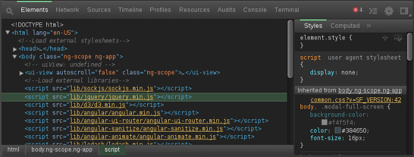

Themes
======

Newer versions of chrome officially support custom skins for the developer tools by simply installing chrome extensions. Older versions can still have custom themes, but requires manually copy and pasting a stylesheet within your chrome application data directory.

[http://devthemez.com/themes/chrome-developer-tools](http://devthemez.com/themes/chrome-developer-tools) lists a variety of skins available.

My particular favorite [Zero Dark Matrix](http://devthemez.com/themes/zero-dark-matrix)